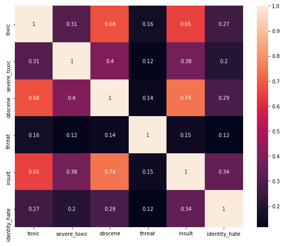
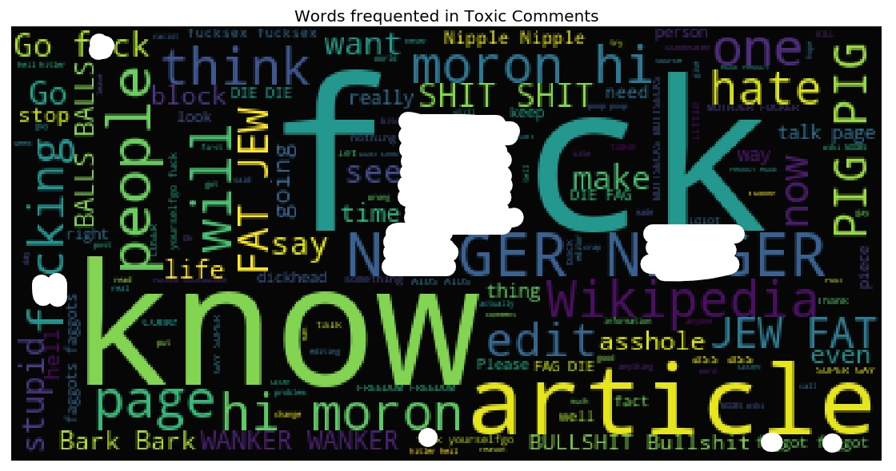
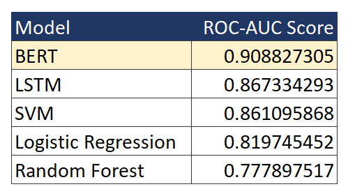

# GGWP - Improving Public Gaming Communities by Analyzing Toxicity

    

# Problem

Toxic behavior, which is aggressive and unwanted behavior towards a particular individual or group, is prevalent in many gaming communities. This remains a huge issue for game developers due to multiple reasons:
* Worsens User Experience - Toxic behaviors negatively impact the gaming experience of surrounding players
* Impacts Retention - Players are less likely to continue playing if they are subject to toxicity
* Difficult to Identify - Due to the magnitude of interactions occuring simultaneously, it is difficult to identify what is toxic

Large game developers most likely have a dedicated team to address the problems above. However small game developers with limited resources may lack the tools and expertise to decrease or eliminate toxicity within their communities.

# Solution

Our team of 5 UC Berkeley Students partnered with [GGWP](https://www.ggwp.com/) to provide game developers the tools to identify toxic behavior communities on public platforms, such as Twitter, Twitch, and Discord. Our solution is a system that consists of three major parts:
1. Data Collection
2. Toxic Classification
3. Summary Report

With this system, game developers can understand toxicity surrounding their games within public social platforms. This will enable them to protect and nurture positivity within their communities. 

# Exploratory Analysis

Our team decided to use the [Jigsaw Dataset](https://www.kaggle.com/c/jigsaw-toxic-comment-classification-challenge/data) that contains Wikipedia comments to train our classification models. This dataset has multiple labels for different types of toxicity: i) toxic, ii) severe_toxic, iii) obscene, iv) threat, v) insult, and vi) identity_hate. The occurences of the labels are shown below:

Our training data is clearly imbalanced. We have to keep in mind that we will need to address this when evaluating our models.

In this correlation matrix, we see that toxic is corerlated with all labels, and most significantly for obscene and threat. Threat is least correlated with the rest of the labels.

Lastly, here is a word cloud that shows most frequent words within toxic comments:

# Data Collection

Our system currently supports data scraping for three major social platforms: Twitter, Twitch, and Discord. We wrote scripts that interact with these platforms' APIs to extract text based on our requirements. 

* For Twitter, we extracted twitter posts that contain a certain keyword related to the game
* For Twitch, we extracted chat logs from popular channels that were streaming the game desired
* For Discord, we extracted conversations from large discord channels discussing the game

The actual scripts are located in this [scraping_folder](https://github.com/pl2599/GGWP-Toxic-Behavior/tree/main/scraping).

# Toxic Classification

After training our model on the jigsaw puzzle dataset, we compared our models using a validation dataset. Our validation dataset consists of manually labeled data from Twitter, Twitch, and Discord. 

One problem that we encountered, however, is imbalanced data. Much like our training data, we saw a lot more clean comments compared to toxic ones. In order to gather more toxic data, we used our logistic regression model to highlight potentially toxic texts, and later manually labeled them. This allowed us to have a more balanced validation dataset with an equal proportion of toxic vs non-toxic.

To further address the imbalanced data, we used the area under the receiving operating characteristic curve (ROC-AUC) as our evaluation metric. In the end, we compared Logistic Regression, Support Vector Machine, Random Forest, LSTM, and BERT. The ROC-AUC scores for each model evaluated on the validation set are shown below:

As you can see, our champion model is BERT, as it has the highest ROC-AUC. 

The models are located in this [models_folder](https://github.com/pl2599/GGWP-Toxic-Behavior/tree/main/models).

# Summary Report

Using our champion BERT model, we analyzed the toxicity of communities for League of Legends and Player Unknown Battlegrounds across the three platforms. 

The bar charts below summarize the distribution of the different types of toxicity for each game across the platforms:

Highlights:
* _Severe toxic_ and _threat_ comments usually include words aboutd eath and severe crime
* For PUBG, a larger proportion of toxic comments are severely toxic (e.g. 10% for PUBG Twitter compared to 2% for LoL Twitter)

The summary reports can be viewed in this [reports_folder](https://github.com/pl2599/GGWP-Toxic-Behavior/tree/main/reports)